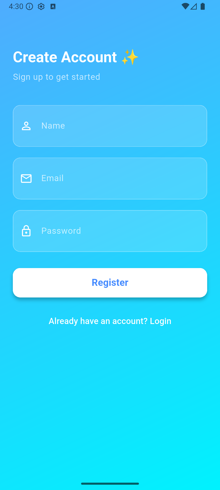

# 💰 Flutter Expense Tracker App

A Flutter application for tracking daily expenses with **Firebase Authentication**, **Cloud Firestore** for remote storage, and **Hive** for offline storage.  
The app uses **BLoC (Cubit)** for state management and stores the user locally to check if they are logged in on app startup.

---

## 📸 Screenshots

| Splash Screen | Login Screen | Register Screen | Expense List |
|--------------|--------------|-----------------|--------------|
|  |  |  |  |

> 📌 Store the actual screenshot images in the `screenshots/` folder of your project.


> 📌 Replace these placeholders with actual screenshots stored in a `screenshots/` folder.

---

## ✨ Features

- 🔑 **Firebase Authentication** for secure login
- 📂 **Hive local storage** for offline persistence
- ☁ **Firestore** for remote database
- 📱 **Real-time expense list updates**
- 🖋 **Add, edit, delete, mark invalid** expenses
- 💡 **Splash screen** that automatically checks login status
- ⚡ **BLoC (Cubit)** for predictable state management
- 🛠 **GetIt** for dependency injection

---

## 🚀 Getting Started

### 1️⃣ Clone the repository
```bash
git clone https://github.com/yourusername/expense-tracker.git
cd expense-tracker
